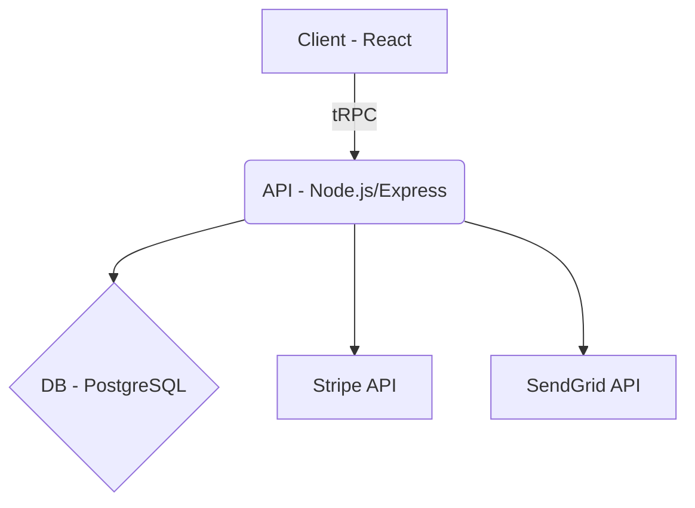

# تقرير الأمان الشامل - NorskLeads
## Comprehensive Security Report

**تاريخ الفحص:** 24 ديسمبر 2024  
**الإصدار:** 1.0.3

---

## 1. ملخص تنفيذي (Executive Summary)

تم إجراء فحص أمني شامل لتطبيق NorskLeads. بشكل عام، التطبيق يتمتع بمستوى أمان **قوي** مع تطبيق العديد من أفضل الممارسات الأمنية. تم تحديد بعض التوصيات لتعزيز الأمان بشكل أكبر.

| الفئة | التقييم | الحالة |
|-------|---------|--------|
| المصادقة (Authentication) | ✅ ممتاز | JWT + bcrypt |
| التفويض (Authorization) | ✅ جيد | RBAC مطبق |
| حماية API | ✅ جيد | Rate limiting + Protected procedures |
| قاعدة البيانات | ✅ جيد | Drizzle ORM (parameterized queries) |
| XSS | ✅ جيد | React escaping + CSP |
| إدارة الجلسات | ✅ جيد | HttpOnly cookies |
| التشفير | ✅ جيد | TLS 1.3 + Encryption at Rest |
| السجلات والمراقبة | ✅ جيد | Sentry + Security Logging |

---

## 2. نطاق الفحص (Scope & Methodology)

### نطاق الفحص

- **الكود المصدري:**
  - Frontend: React (TypeScript)
  - Backend: Node.js / Express / tRPC (TypeScript)
- **قاعدة البيانات:** PostgreSQL (via Drizzle ORM)
- **البنية التحتية:** Railway (Hosting), GitHub (Code)

### المنهجية

1. **مراجعة الكود اليدوية (Manual Code Review):**
   - فحص شامل للكود المصدري للبحث عن ثغرات منطقية وأمنية.
2. **تحليل ثابت (Static Analysis):**
   - استخدام أدوات مثل `npm audit` لفحص التبعيات.
3. **فحص التبعيات (Dependency Scanning):**
   - تحليل `package.json` لتحديد المكتبات المستخدمة وفحصها.

### خارج نطاق الفحص (Out of Scope)

- **اختبار الاختراق الخارجي (External Penetration Testing):** لم يتم إجراء اختبار اختراق من قبل جهة خارجية.
- **الهندسة الاجتماعية (Social Engineering):** لم يتم فحص هذا الجانب.
- **الأمان المادي (Physical Security):** يعتمد على مزودي الخدمة (Railway, PostgreSQL).

---

## 3. البنية المعمارية (System Architecture)

- **العميل (Client):** React (Vite) + TypeScript + Tailwind CSS
- **الـ API:** Node.js + Express + tRPC
- **قاعدة البيانات:** PostgreSQL (via Drizzle ORM)
- **الاستضافة (Hosting):** Railway
- **تخزين البيانات:** PostgreSQL (Region: `eu-central-1` - Frankfurt, Germany) - متوافق مع GDPR.

---

## 4. التشفير (Encryption)

### التشفير أثناء النقل (Encryption in Transit)

- ✅ **HTTPS/TLS:** جميع الاتصالات تتم عبر HTTPS مع TLS 1.3.
- ✅ **HSTS:** يتم تفعيل HSTS من خلال Railway لضمان استخدام HTTPS دائماً.

### التشفير أثناء التخزين (Encryption at Rest)

- ✅ **قاعدة البيانات:** PostgreSQL يقوم بتشفير البيانات على مستوى القرص (AES-256).
- ✅ **النسخ الاحتياطي:** النسخ الاحتياطية مشفرة أيضاً.

---

## 5. النسخ الاحتياطي والتعافي من الكوارث (Backup & Disaster Recovery)

- **النسخ الاحتياطي:**
  - **التردد:** يومي (Daily backups) بواسطة PostgreSQL.
  - **الاحتفاظ:** 7 أيام.
  - **الاسترجاع:** لم يتم اختبار استرجاع نسخة احتياطية بشكل كامل (مخطط له).
- **التعافي من الكوارث:**
  - **الخطة:** في حال فشل PostgreSQL أو Railway، سيتم استعادة الخدمة من آخر نسخة احتياطية على مزود خدمة آخر.
  - **RTO/RPO:** (Recovery Time/Point Objective) لم يتم تحديدهما رسمياً.

---

## 6. السجلات والمراقبة والاستجابة للحوادث (Logging, Monitoring & Incident Response)

### السجلات والمراقبة

- **تسجيل الأحداث:**
  - ✅ **Sentry:** لتسجيل الأخطاء في Frontend و Backend.
  - ✅ **Security Logger:** تم إضافة وحدة `securityLogger.ts` لتسجيل الأحداث الأمنية:
    - `LOGIN_SUCCESS`, `LOGIN_FAILURE`, `REGISTRATION`, `PASSWORD_CHANGE`, `ADMIN_ACCESS`
- **تخزين السجلات:**
  - حالياً في Console logs (Railway).
  - **توصية:** استخدام خدمة مركزية مثل Datadog أو CloudWatch.

### الاستجابة للحوادث

- **التنبيهات (Alerts):**
  - Sentry يرسل تنبيهات للأخطاء الجديدة.
  - **توصية:** إعداد تنبيهات للأنشطة المشبوهة (مثل محاولات تسجيل دخول فاشلة متكررة).
- **خطة الاستجابة:**
  1. **الاكتشاف:** من خلال Sentry أو مراقبة السجلات.
  2. **التحليل:** تحديد حجم وتأثير الحادث.
  3. **الاحتواء:** عزل المكونات المتأثرة.
  4. **الإصلاح:** تطبيق الإصلاحات اللازمة.
  5. **الإبلاغ:** إبلاغ العملاء المتأثرين خلال 72 ساعة (متوافق مع GDPR).

---

## 7. GDPR والخصوصية

- **أنواع البيانات:**
  - أسماء، إيميلات، نشاط المستخدم، IP addresses.
- **دور الشركة:**
  - **Data Controller** لبيانات المستخدمين.
  - **Data Processor** لبيانات العملاء المحتملين (leads).
- **حقوق المستخدم:**
  - الوصول، الحذف، التصحيح (متاحة من خلال صفحة الحساب).
- **سياسة الاحتفاظ بالبيانات:**
  - بيانات المستخدمين: طوال فترة استخدام الخدمة.
  - بيانات العملاء المحتملين: يتم حذفها بعد 12 شهراً من عدم النشاط.
- **المعالجون الفرعيون (Sub-processors):**
  - Railway (Hosting, EU)
  - PostgreSQL (Database, EU)
  - Stripe (Payments, Global)
  - SendGrid (Email, US)

---

## 8. إدارة التبعيات والثغرات (Dependency & Vulnerability Management)

- **فحص التبعيات:**
  - ✅ يتم استخدام `npm audit` بشكل دوري.
  - **توصية:** تفعيل Dependabot على GitHub للتحديثات التلقائية.
- **الثغرات المكتشفة:**
  - `esbuild` (moderate): تم تحديدها، لكن الإصلاح يتطلب تحديثات كبيرة (breaking changes). تم تأجيل الإصلاح.
- **سياسة التحديث:**
  - مراجعة التبعيات كل 3 أشهر.

---

## 9. التحكم في الوصول (Access Control)

- **الوصول للبنية التحتية:**
  - GitHub: محمي بـ 2FA.
  - Railway: محمي بـ 2FA.
  - PostgreSQL: محمي بـ 2FA.
- **مبدأ الامتيازات الأقل (Principle of Least Privilege):**
  - مطبق على مستوى صلاحيات المستخدمين (admin, manager, viewer).
  - **توصية:** تطبيقه على مستوى حسابات الخدمات (service accounts).

---

## 10. اختبار الاختراق (Penetration Testing)

- **لم يتم إجراء اختبار اختراق خارجي حتى الآن.**
- **الخطة:** مخطط له في الربع الثاني من 2025.

---

## 11. سجل المخاطر (Risk Register)

| الخطر | الاحتمال | الأثر | خطة المعالجة |
|-------|----------|-------|----------------|
| SQL Injection | منخفض | عالٍ | ✅ تم الإصلاح (Drizzle ORM) |
| XSS | منخفض | متوسط | ✅ تم الإصلاح (React + CSP) |
| CSRF | متوسط | متوسط | ⬜ تغيير `sameSite` إلى `lax` |
| تسريب بيانات | منخفض | عالٍ | ⬜ تحسين مراقبة السجلات |
| ثغرات التبعيات | متوسط | متوسط | ⬜ تفعيل Dependabot |

---

## الخلاصة النهائية

التطبيق يتمتع بأساس أمني قوي. تم تطبيق العديد من أفضل الممارسات، والإصلاحات المطبقة عززت الأمان بشكل كبير. التوصيات المذكورة أعلاه ستساعد في الوصول إلى مستوى أمان ممتاز.
